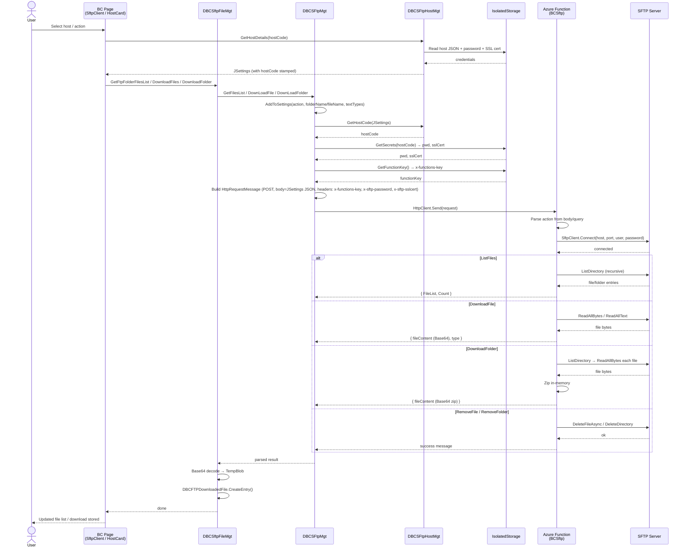

# CLAUDE.md

This file provides guidance to Claude Code (claude.ai/code) when working with code in this repository.

## Project Overview

A two-component system for SFTP access from Microsoft Dynamics 365 Business Central:

- **`davesbcsftp/`** — C# Azure Functions project that acts as an SFTP proxy API
- **`al/`** — Business Central AL extension that calls the Azure Function from within BC

## Commands

All commands run from the `davesbcsftp/` directory unless noted.

**Build (debug):**
```bash
dotnet build
```

**Publish (release):**
```bash
dotnet publish -c Release -o ./publish
```

**Run locally** (requires Azure Functions Core Tools):
```bash
func host start
```
The VS Code task "build (functions)" followed by the `func` task automates this. The local function starts from `bin/Debug/net9.0`.

**Deploy to Azure** (see `docs/AzureDeployNotes.md` for full options):
```bash
func azure functionapp publish <your-function-app-name> --dotnet-isolated
```

The AL extension is built and deployed via the VS Code AL extension (BC27 target, runtime 16.0, no external dependencies).

## Architecture

### C# Azure Function (`davesbcsftp/`)

Single HTTP-triggered function `BCSftp` in `DavesBCSftpFunctions.cs` — .NET 9, Azure Functions v4, Isolated Worker model.

- **Auth:** `AuthorizationLevel.Function` — callers must supply `x-functions-key` header.
- **SFTP credentials:** passed per-request via `x-sftp-password` header (and optionally `x-sftp-sslcert`). No credentials are stored server-side.
- **Routing:** the `action` field (query string or JSON body) dispatches to one of five operations: `ListFiles`, `DownloadFile`, `DownloadFolder`, `RemoveFile`, `RemoveFolder`.
- **Connection:** `SftpClient` (SSH.NET) is created, connected, used, and disconnected within each request. Default port 22.
- **File listing:** recursive — `GetFiles` calls itself for subdirectories, skipping dot-files and non-regular/non-directory entries.
- **Downloads:** file content is returned as Base64-encoded JSON (`{ fileContent, type }`). Folder downloads are zipped in-memory (single directory level only, not recursive) and returned as Base64.
- **JSON body:** connection settings (hostName, userName, port, folderName/fileName, rootFolder, textTypes) are passed as a flat JSON object in the POST body.

### AL Extension (`al/`)

BC27 extension (platform 27.0.0.0, runtime 16.0, no dependencies).

**Key codeunits:**

| Codeunit | Role |
|---|---|
| `DBCSFtpMgt` (50134) | HTTP layer — builds requests, sends to Azure Function, parses responses |
| `DBCSftpFileMgt` (50136) | File/folder download orchestration, stores results to `DBCFTPDownloadedFile` |
| `DBCSFtpHostMgt` | Host record management, retrieves secrets (password, SSL cert) |
| `DBCSftpParams` | Builds the JSON settings object passed to `DBCSFtpMgt` |

**Key tables:**

| Table | Purpose |
|---|---|
| `DBCSftpSetup` | Single-record setup: Azure Function URL, function key, text file extensions |
| `DBCSFtpHost` | One record per SFTP host (hostname, port, username, credentials stored as secrets) |
| `DBCSftpFileBuffer` | Temporary buffer of files/folders from a `ListFiles` call |
| `DBCFTPDownloadedFile` | Persistent store of downloaded file contents (blob) |

**Request flow:** BC pages call `DBCSftpFileMgt` → `DBCSFtpMgt.BuildRequest` assembles JSON settings + auth headers → POST to `BCSftp` Azure Function → response parsed and stored/displayed.

**Secrets:** SFTP password and SSL cert are stored in BC as `SecretText` on the host record and injected as `x-sftp-password` / `x-sftp-sslcert` headers at request time. The Azure Function key is stored in `DBCSftpSetup` as a secret.

## Architecture Flow


