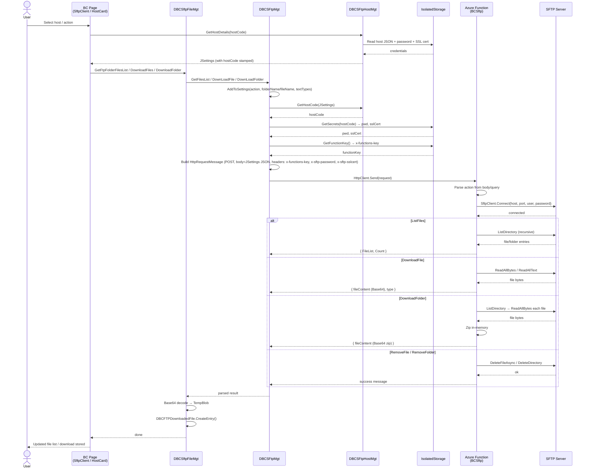

# Business Central Azure Function sftp Demo

Demo of using SSH.NET Sftp Azure Function in Business Central.

Sftp Client

## Included

AL - Project for Business Central Sftp Client.

DavesBCSftp - C# Azure Function Project, can be published to Azure or ran in local container for testing.

## Functionality

Add, Edit and Delete hosts.

Download files and folders.
zu
Functionality provided to downloaded single | multiple files, and folders.

* Downloaded Files table allows the contents to be processed within Business Central.

* Downloaded folders are compressed to a zip format, and entries can be extracted and viewed via the client.

## Architecture Flow

## Images

### Author: Dave Sinclair (2024)
