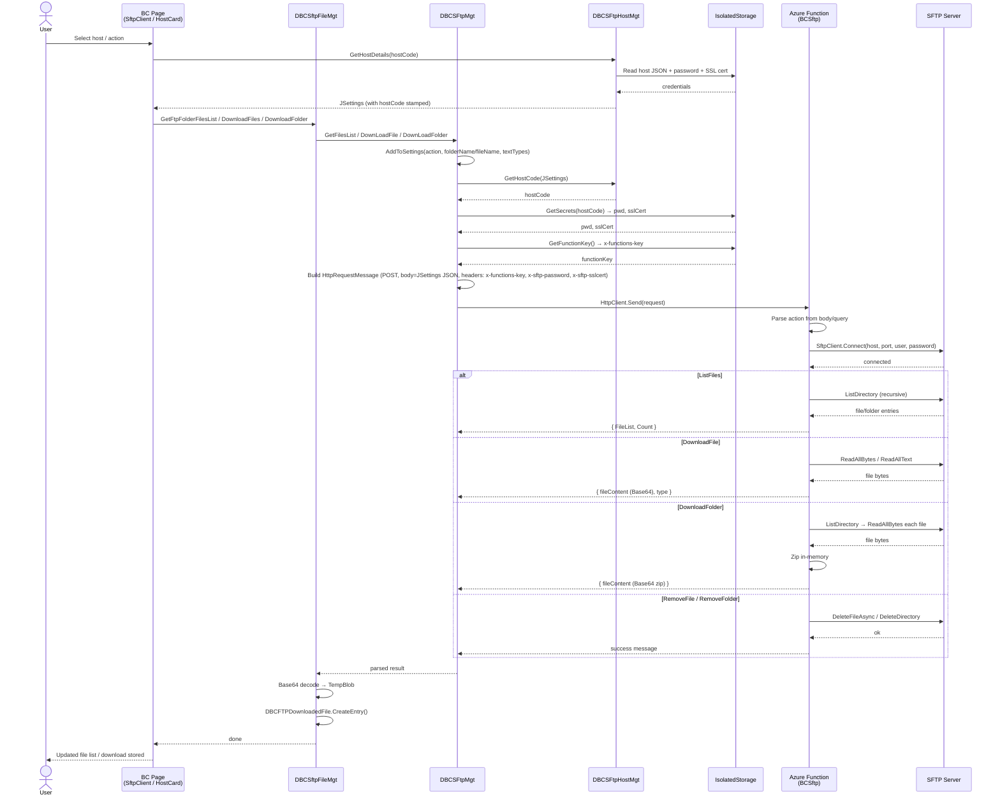
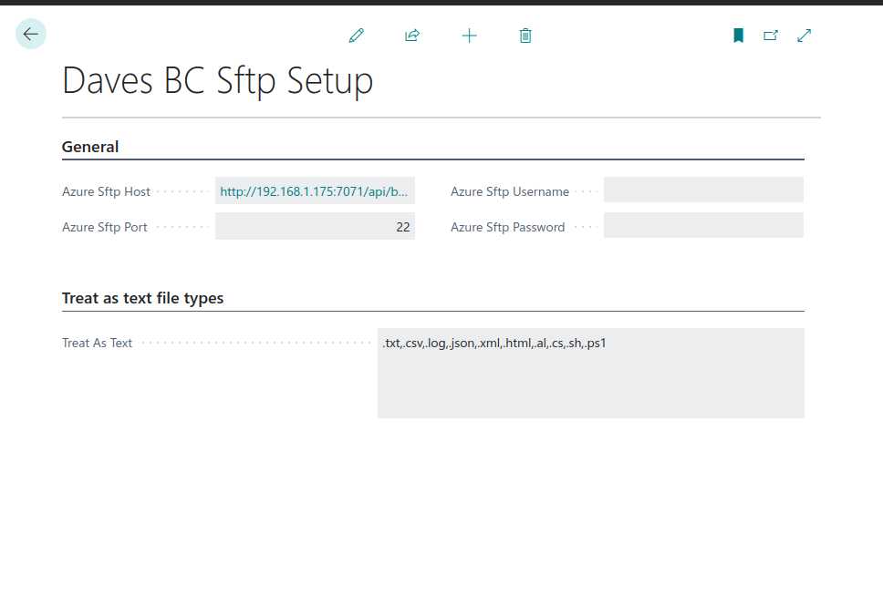
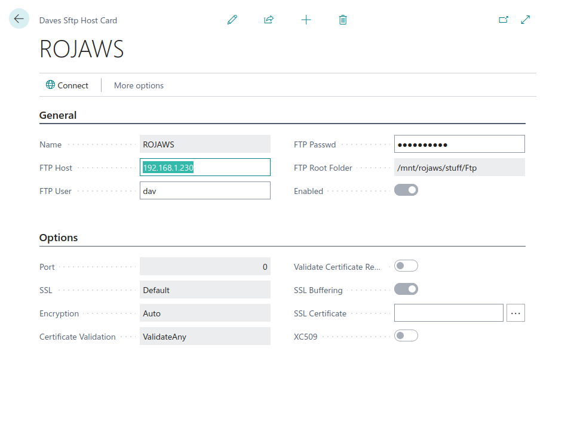
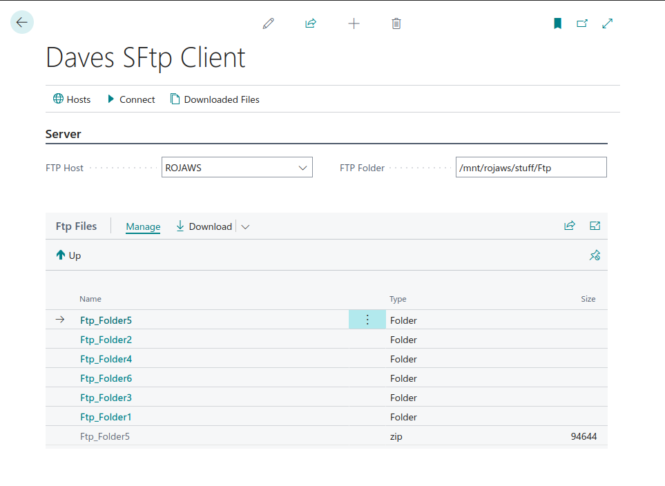
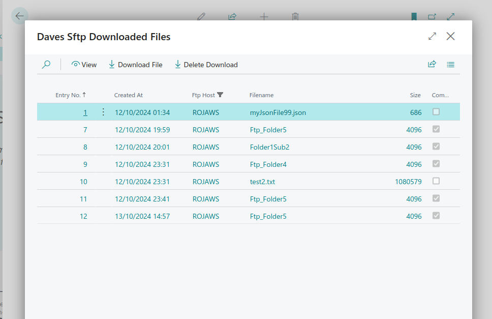
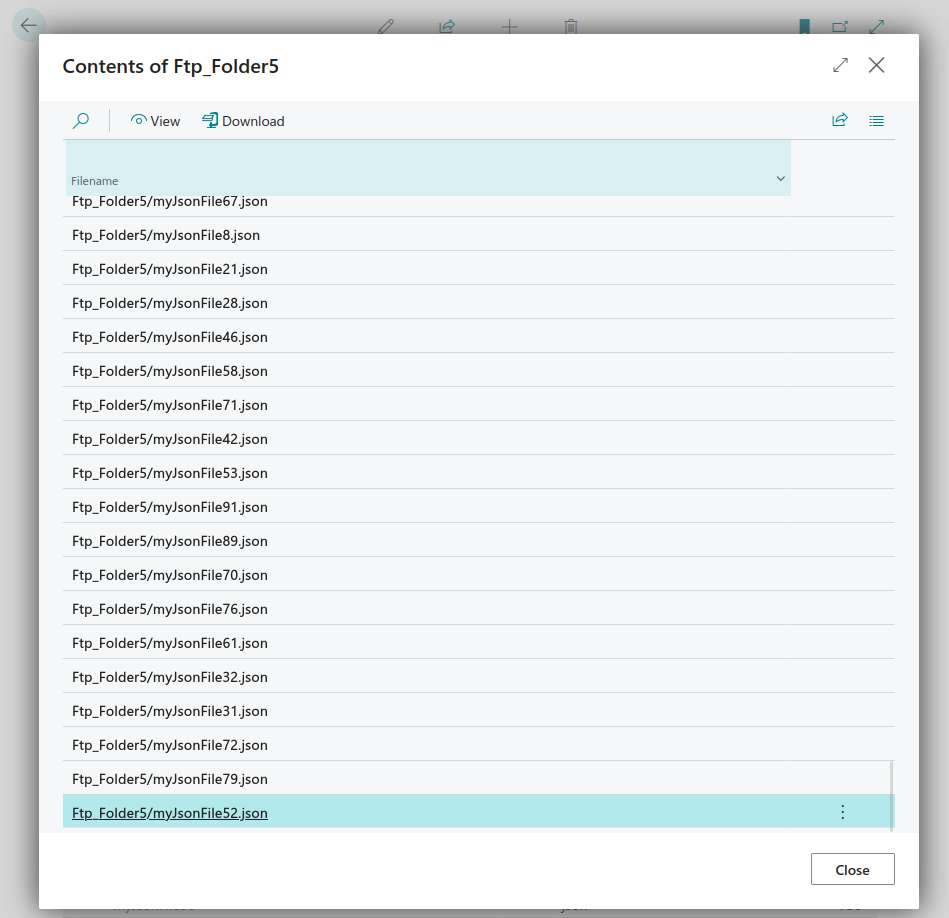
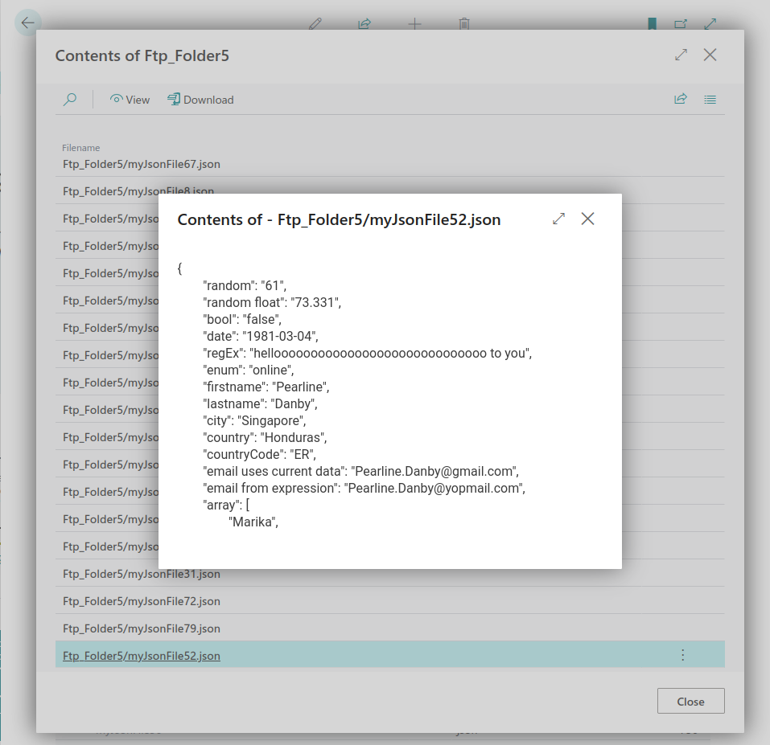

# Daves BC SFTP

SFTP client functionality for Microsoft Dynamics 365 Business Central. Two versions available — choose based on your BC platform version.

---

## Versions

### v27 — Azure Function (BC27)

**Location:** `al/`

BC extension that connects to SFTP via a C# Azure Function proxy (SSH.NET). Works on BC27 and earlier cloud/on-prem environments where the native SFTP client is unavailable.

**Requires:** Azure Functions deployment (`davesbcsftp/`)

| Feature | Detail |
|---|---|
| BC version | 27 (platform 27.0.0.0, runtime 16.0) |
| SFTP backend | Azure Function (SSH.NET) |
| Credentials | Passed per-request via headers; stored in BC Isolated Storage |
| Auth | Azure Function key (`x-functions-key`) |
| Deploy | Publish C# Function App + install AL extension |

**Wiki:** [`al/docs/wiki/`](al/docs/wiki/Home.md)

- [Home](al/docs/wiki/Home.md)
- [Setup](al/docs/wiki/Setup.md) — Configure the Azure Function endpoint and function key
- [SFTP Hosts](al/docs/wiki/SFTP-Hosts.md) — Add and manage SFTP host connections
- [SFTP Client](al/docs/wiki/SFTP-Client.md) — Browse folders and download files
- [Downloaded Files](al/docs/wiki/Downloaded-Files.md) — View and manage your download history
- [File Viewer](al/docs/wiki/File-Viewer.md) — Supported file formats and the built-in viewer
- [Azure Function Deployment](al/docs/wiki/Azure-Function-Deployment.md) — Deploy or run the Azure Function backend

---

### v28 — Pure AL / Native SFTP (BC28)

**Location:** `al-bc28/`

BC extension that uses the native BC28 SFTP Client codeunit (9762) — no Azure Function or external proxy required.

| Feature | Detail |
|---|---|
| BC version | 28 (platform 28.0.0.0, runtime 17.0) |
| SFTP backend | Native `SFTP Client` codeunit 9762 |
| Credentials | Stored in BC Isolated Storage |
| Auth | None — direct SSH connection from BC |
| Deploy | Install AL extension only |
| Extra | Host key pinning (SHA256 fingerprint) |

**Wiki:** [`al-bc28/docs/wiki/`](al-bc28/docs/wiki/Home.md)

- [Home](al-bc28/docs/wiki/Home.md)
- [Setup](al-bc28/docs/wiki/Setup.md) — Configure text file type handling
- [SFTP Hosts](al-bc28/docs/wiki/SFTP-Hosts.md) — Add and manage SFTP host connections
- [SFTP Client](al-bc28/docs/wiki/SFTP-Client.md) — Browse folders and download files
- [Downloaded Files](al-bc28/docs/wiki/Downloaded-Files.md) — View and manage your download history
- [File Viewer](al-bc28/docs/wiki/File-Viewer.md) — Supported file formats and the built-in viewer

---

## Shared Functionality

Both versions provide:

- Browse any SFTP server — recursive folder navigation within BC
- Multiple host support — define and switch between SFTP hosts
- Download single files, multiple files, or entire folders (compressed to zip)
- Built-in file viewer — text, JSON, XML, CSV (table), images, PDFs, Excel (XLSX/XLS)
- Zip explorer — browse and extract entries from downloaded zip/folder archives
- All credentials stored securely in BC Isolated Storage

---

## Architecture — v27 Azure Function Flow

---

## Screenshots

---

### Author: Dave Sinclair (2024)
