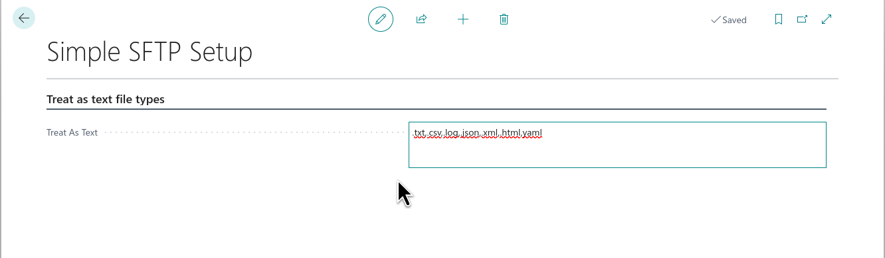

# Setup

The **BC Simple SFTP Setup** page is a single-record configuration card. Open it by searching for **BC Sftp Setup** in the BC search bar.

---

## Fields

### Treat as text file types

| Field | Description |
|---|---|
| **Treat As Text Files** | Comma-separated list of file extensions downloaded and stored as UTF-8 text rather than raw binary. The SFTP client uses this list to decide whether to read the remote file as text or bytes. Default: `.txt,.csv,.log,.json,.xml,.html,.al,.cs,.sh,.ps1` |

> **Note:** Unlike the BC27 Azure Function version, there is no Azure endpoint or function key to configure here. All SFTP connections are made directly from BC using the native SFTP Client codeunit.

---

## First-time setup steps

1. Open **BC Sftp Setup** from the BC search bar.
2. Adjust **Treat As Text Files** if you work with additional plain-text file formats.
3. Add at least one SFTP host (see [[SFTP-Hosts]]).
