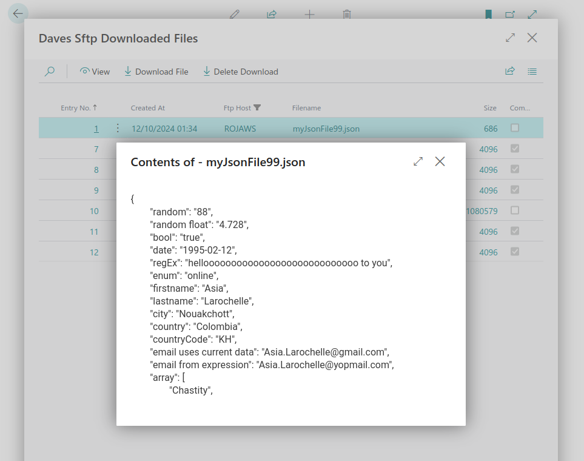

# File Viewer

The built-in file viewer opens directly inside Business Central without requiring any local application. It automatically selects the appropriate renderer based on the file extension.



---

## Supported formats

| Format | Extensions | How it renders |
|---|---|---|
| **Plain text / code** | `.txt` `.log` `.al` `.cs` `.sh` `.ps1` `.html` and any unrecognised extension | Monospaced pre-formatted text with word wrap |
| **JSON / XML** | `.json` `.xml` | Same as plain text |
| **CSV** | `.csv` | Parsed and rendered as a scrollable table with a styled header row |
| **Images** | `.png` `.jpg` `.jpeg` `.gif` `.svg` `.webp` `.bmp` `.ico` | Inline image display, scaled to fit the viewer |
| **PDF** | `.pdf` | Embedded browser PDF viewer |
| **Excel** | `.xlsx` `.xls` | Rendered as a table using SheetJS; workbooks with multiple sheets show a tab bar at the top |

---

## Text file types

Which extensions are treated as plain text (and therefore downloaded via `ReadAllText` on the server rather than `ReadAllBytes`) is controlled by the **Treat As Text** setting on the [[Setup]] page. The default list is:

```
.txt, .csv, .log, .json, .xml, .html, .al, .cs, .sh, .ps1
```

Any extension not in this list is downloaded as raw binary. The viewer will still attempt to display it correctly based on the extension.

---

## Excel viewer dependency

The Excel viewer uses **SheetJS** (xlsx.js v0.18.5), loaded on demand from cdnjs when an Excel file is opened for the first time. This requires internet access from the BC browser session.

**Licence:** SheetJS v0.18.5 is published under the **Apache 2.0** licence — free for commercial use with no attribution required in output.

If internet access is not available, bundle `xlsx.full.min.js` locally by:
1. Downloading `xlsx.full.min.js` from [cdnjs](https://cdnjs.cloudflare.com/ajax/libs/xlsx/0.18.5/xlsx.full.min.js)
2. Placing it in `al/src/controladdins/filecontent/scripts/`
3. Adding it to the `Scripts` array in `DBCSFtpFileContent.ControlAddin.al`

---

## Notes

- The viewer is **read-only** — no editing is possible.
- Very large files may be slow to render in the text viewer.
- PDF rendering depends on the browser's built-in PDF support (available in all modern Chromium-based browsers used by BC).
