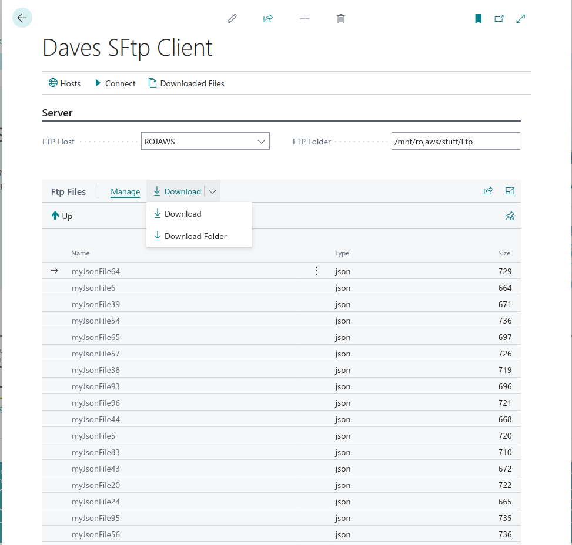

# SFTP Client

The **Daves SFtp Client** is the main browsing interface. Search for **BC FTP** in the BC search bar to open it.

---

## Connecting to a host

1. Select a host from the **FTP Host** dropdown — only enabled hosts appear.
2. The **FTP Folder** field is populated with the host's configured root folder. You can change this to start browsing from a different path.
3. Click **Connect** to list the contents of the folder.

The file list shows folders first (highlighted in blue), followed by files with their type and size.

---

## Navigating folders

| Action | How |
|---|---|
| **Open a folder** | Click (drill down) on any folder name in the list |
| **Go up one level** | Click the **Up** button in the action bar, or click the `..` entry at the top of the list |

The **FTP Folder** field at the top always reflects the folder currently being browsed.

---

## Downloading files

Select one or more files in the list, then use the **Download** split button:

| Action | Description |
|---|---|
| **Download** | Downloads the selected file(s) and stores them in the [[Downloaded-Files]] table |
| **Download Folder** | Downloads the selected folder and all its contents, compressed into a single zip file |

Multi-select is supported for **Download** — hold Shift or Ctrl to select multiple files before clicking.

> **Note:** Folder downloads only include files at the top level of the selected folder, not sub-folders.

---

## Other actions

| Button | Description |
|---|---|
| **Hosts** | Opens the SFTP Hosts list to add or edit hosts |
| **Downloaded Files** | Opens the [[Downloaded-Files]] list filtered to the currently selected host |
